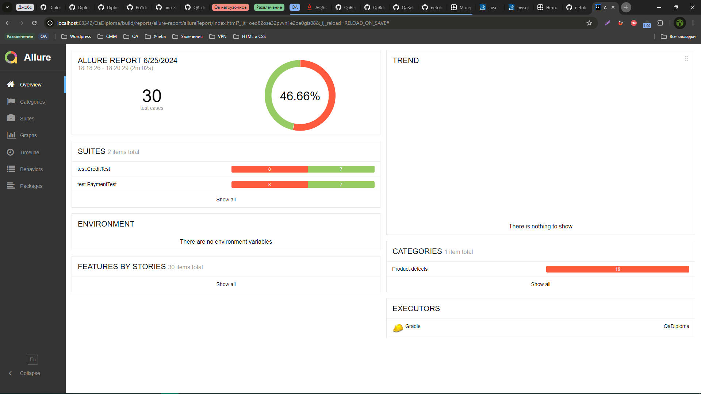
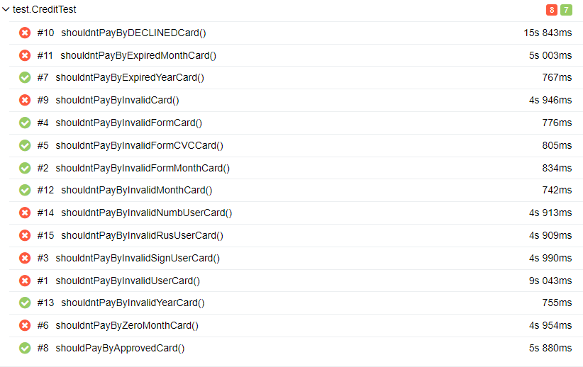
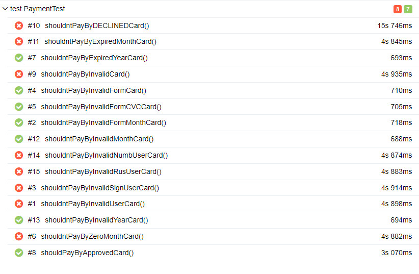

# Отчет по итогам тестирования

## Краткое описание

Было проведено автоматизированное тестирование позитивных и негативных сценариев покупки тура.
Предварительно было проведено исследовательское тестирование для ознакомления с проектом.
Согласно задаче были написаны тесты UI

## Результаты тестирования

- Всего было тест-кейсов: 30
- Успешных: 14 (46,66%)
- Не успешных: 16 (53,33%)

## Общие рекомендации

По результатам тестирования были заведены [Issues](https://github.com/GreeceNut/QaDiploma/issues) 